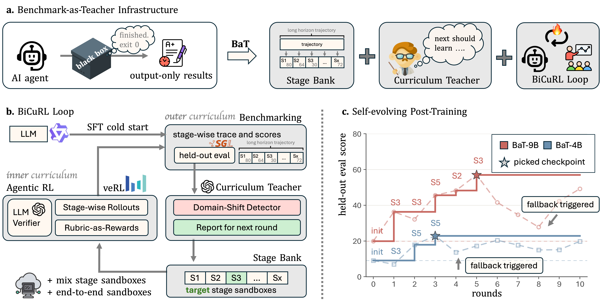
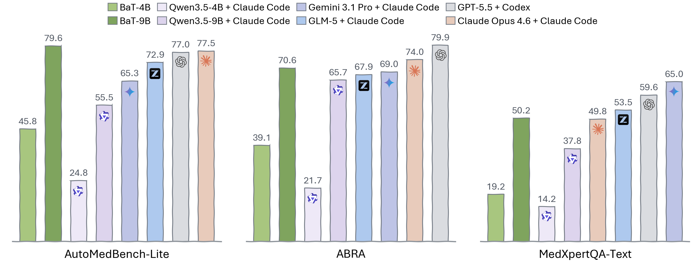

# Benchmark-as-Teacher

[English](README.md) | [简体中文](README_zh.md)

[](https://opensource.org/licenses/MIT)
[](https://arxiv.org/abs/2608.16211)
[](https://kumakuma2002.github.io/bat/)
[](https://huggingface.co/collections/MitakaKuma/benchmark-as-teacher)
[](https://huggingface.co/spaces/MitakaKuma/AutoMedBench-Leaderboard)

Benchmark-as-Teacher（BaT）是一个 self-evolving post-training framework，将 structured benchmark 转化为 long-horizon agent 的 training infrastructure。BaT 在 evaluation 与 training 之间形成 closed loop：stage-level rubric 负责诊断能力缺口，held-out-safe data bank 提供针对性训练样本，grouped rollout 通过 GRPO 完成优化。更新后的 checkpoint 随后依据同一 benchmark contract 重新 evaluation，从而形成递归式能力提升。



## Quick Start

完整 training 与 loop 流程见 [docs/process.md](docs/process.md)。

```bash
# 1. Build the held-out-safe source grid
python -m scripts.build_bat_semantic_source --output-dir /path/to/safe-source

# 2. One-time cold-start SFT
python -m scripts.prepare_sft_dataset --source /path/to/safe-source/source.jsonl --output-dir /path/to/sft-data
python -m scripts.sft_train --data /path/to/sft-data --output-dir /path/to/sft-checkpoint

# 3. Build a BaT round
python -m scripts.build_bat_core_dataset \
  --source /path/to/safe-source/source.jsonl \
  --source-sha256 "$(sha256sum /path/to/safe-source/source.jsonl | cut -d' ' -f1)" \
  --round-id r01 --target-stage S3 \
  --output-dir /path/to/r01-data

# 4. Launch GRPO round
bash rl/grpo/launch_core_grpo.sh

# 5. Evaluate and gate
python -m scripts.run_bat_core_eval --manifest /path/to/r01-data/manifest.json --output-dir /path/to/r01-eval
python -m scripts.check_bat_core_gate --baseline /path/to/baseline-eval --candidate /path/to/r01-eval --output-dir /path/to/r01-gate

# 6. Run the full loop
python -m scripts.run_bat_core_loop --rounds 10 --output-dir /path/to/bat-run
```

## BaT

### Stage Bank

Stage Bank 是 asynchronous data pipeline，在 policy-update loop 之外生成 held-out-safe training state。它构造 fictional task、重建 executable stage state，并在任何数据进入 training 前执行 leakage check。

Reference grid 为每一个 `focus x track x outcome` cell 提供一个 abstract state：

```text
6 focus values (E2E and S1-S5)
x 7 benchmark tracks
x 3 outcomes (success, recovery, failure)
= 126 held-out-safe source states
```

每个 state 均保持 content isolation：task identity、answer、report、trace 与 correction text 不会跨越 evaluation firewall。

### BiCuRL

Bilevel Curriculum Reinforcement Learning（BiCuRL）是 self-improving post-training method。outer loop 从固定的 held-out evaluation 读取 stage score，选择下一轮 target stage，并决定保留或拒绝 candidate checkpoint。inner loop 从 Stage Bank 采样 state，以 rubric item 与 artifact evidence 评价新 rollout，并通过 GRPO 更新 policy。

## BaT Agent

当 trained policy 与包含 public stage skill 的固定 execution environment 组合时，即构成 BaT Agent。engineering layer 在不同 comparison 中保持固定，因此 BiCuRL 仅改变 policy。



在 AutoMedBench-Lite 上，BaT-4B 与 BaT-9B 的 Overall score 均超过各自 Qwen Instruct baseline 的两倍。BaT-9B Agent 达到 79.6 Overall，高于 Claude Opus 4.6 with Claude Code 的 77.5。

## Infrastructure

BaT 面向 infrastructure 设计。Training Engine 与 Inference Engine 可独立替换，并支持下列全部组合：

| Training Engine | Inference Engine | Status |
|-----------------|------------------|--------|
|  VeRL |  vLLM | Supported |
|  VeRL |  SGLang | Supported |
|  Slime |  vLLM | Supported |
|  Slime |  SGLang | Supported |

## Citation

```bibtex
@article{liu2026bat,
  title={BaT: Towards Self-Evolving Medical Research Agent with Stage Rubrics},
  author={Liu, Junqi and He, Yufan and He, Yexiao and Guo, Pengfei and Yang, Dong and Myronenko, Andriy and Zhao, Can and Ye, Hanrong and Qi, Tianhao and Zhou, Yuyin and Xu, Daguang and Tang, Yucheng},
  year={2026},
  journal={arXiv preprint arXiv:2608.16211},
  url={https://arxiv.org/abs/2608.16211}
}
```

## License

MIT License，详见 [LICENSE](LICENSE)。
